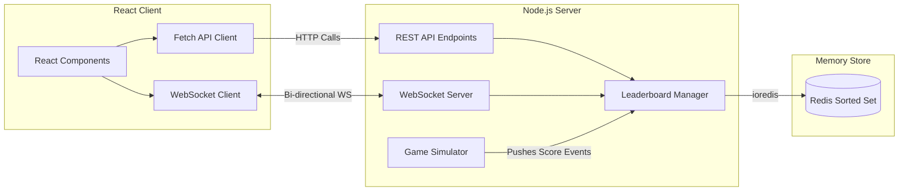

# ⚡ Real-Time Redis Leaderboard Monorepo

Welcome to the **Real-Time Redis Leaderboard** application! This project is a full-stack monorepo demonstrating how to build a high-performance, real-time leaderboard using **Redis Sorted Sets (ZSET)** as the data store and **WebSockets** for instant server-to-client updates.

It features a modern, dark-themed, glassmorphic React UI complete with visual podiums, real-time value highlights, live score distribution charts, and fully integrated simulation and manual control panels.

---
## Live Link : https://scoreboard-q3ri.onrender.com/
## 🚀 Key Features

* **⚡ Real-Time Updates**: Instant board changes broadcasted to all connected clients via native WebSockets.
* **📈 High Performance Sorting**: Powered by Redis Sorted Sets (ZSET), guaranteeing `O(log(N))` complexity for rank updates.
* **🏆 Visual Podium**: Interactive, floating top-3 podium highlighting the current Leader (Champion) and runners-up.
* **📊 Score Spread Chart**: Standalone custom SVG bar chart showcasing the score distribution of the top 12 players.
* **🎮 Background Game Simulation**: Server-side game simulator that pushes mock score updates to random players every 2 seconds.
* **🛠️ Dashboard Controls**: Full ability to manually increase/decrease player scores, add new competitors, delete players, reset scores, or toggle the simulator.

---

## 📐 System Architecture

The monorepo contains a client-server architecture with event-driven updates:



* **Score Change Flow**: Updates from the Simulator or UI are written to Redis. [LeaderboardManager](file:///d:/leaderboard/redis-leaderboard/backend-nodejs-redis/src/LeaderboardManager.ts#L9) then fetches the top rankings and broadcasts a JSON payload to all connected clients.
* For more in-depth architectural details, refer to the [System Architecture Documentation](file:///d:/leaderboard/redis-leaderboard/SYSTEM_ARCHITECTURE.md).

---

## 📂 Project Structure

```bash
redis-leaderboard/
├── package.json                   # Monorepo root configuration
├── SYSTEM_ARCHITECTURE.md          # In-depth system design & diagrams
├── README.md                      # Project documentation
│
├── backend-nodejs-redis/          # Express API + WebSocket + Redis Client
│   ├── src/
│   │   ├── app.ts                 # Server setup and HTTP/WS endpoints
│   │   ├── LeaderboardManager.ts  # Redis Sorted Set logic & client broadcasts
│   │   └── simulation.ts          # Automated game simulation loop
│   ├── package.json
│   └── .env                       # Backend connection configuration
│
└── frontend-reactjs/              # React SPA (TypeScript + Tailwind CSS)
    ├── src/
    │   ├── components/
    │   │   └── Leaderboard.tsx    # Live Leaderboard, Podium, Chart & Admin Panel
    │   ├── App.tsx
    │   └── index.css              # Custom font loading & scrollbar classes
    ├── tailwind.config.js         # Highlight animations definitions
    ├── package.json
    └── .env                       # Frontend env variables (Target WS URL)
```

---

## 🛠️ Getting Started

### Prerequisites
Make sure you have:
* **Node.js (v18+)**
* **Redis Server** running locally (port `6379`) or a cloud instance URL.

### 1. Install Dependencies
From the root directory, run:
```bash
npm run install-deps
```
This script will concurrently install dependencies for both the [backend-nodejs-redis/package.json](file:///d:/leaderboard/redis-leaderboard/backend-nodejs-redis/package.json) and [frontend-reactjs/package.json](file:///d:/leaderboard/redis-leaderboard/frontend-reactjs/package.json).

### 2. Set Up Environment Variables
Create or verify the environment files in each subdirectory:

* **Backend (`backend-nodejs-redis/.env`)**:
  ```env
  REDIS_URL=redis://localhost:6379
  ```
* **Frontend (`frontend-reactjs/.env`)**:
  ```env
  PORT=3001
  REACT_APP_BACKEND_URL=ws://localhost:3000
  ```

### 3. Run the Application

You need to start both the backend server and the frontend client.

#### Start Backend
In a terminal, run:
```bash
cd backend-nodejs-redis
npm run dev
```
The server will start on port `3000`. It will automatically spin up the background simulation and connect to your Redis database.

#### Start Frontend
In a new terminal window, run:
```bash
cd frontend-reactjs
npm start
```
The React development server will start on port `3001` and open the dashboard in your web browser.

---

## 📡 REST API Reference

The backend exposes the following REST API endpoints:

| Endpoint | Method | Description | Body Schema |
| :--- | :--- | :--- | :--- |
| `/leaderboard` | `GET` | Retrieve the top ranking entries. Default count is 100. | Query params: `?count=N` |
| `/score/increase` | `POST` | Increase a player's score by a given amount. | `{"player": "Messi", "score": 250}` |
| `/score/decrease` | `POST` | Decrease a player's score by a given amount. | `{"player": "Ronaldo", "score": 100}` |
| `/player/add` | `POST` | Create a new player with an optional starting score (default 1000). | `{"player": "Haaland", "score": 1200}` |
| `/player/:name` | `DELETE` | Delete a player and remove them from the leaderboard. | None |
| `/leaderboard/reset` | `POST` | Reset all player scores back to 1000. | None |
| `/simulation/start` | `POST` | Start the automatic simulation updates. | None |
| `/simulation/stop` | `POST` | Stop/pause the automatic simulation updates. | None |
| `/simulation/status` | `GET` | Return whether the simulation is currently running. | None |

---

## ⚡ Real-Time WebSockets
The frontend connects to the backend WebSocket server at `ws://localhost:3000`.
- **Payload Format**:
  ```json
  {
    "type": "leaderboard_update",
    "leaderboard": [
      { "player": "Messi", "score": 1500 },
      { "player": "Ronaldo", "score": 1450 }
    ]
  }
  ```
- Position calculations are computed client-side dynamically by matching incoming usernames with their previous index to render green up-arrows, red down-arrows, or static dots.
